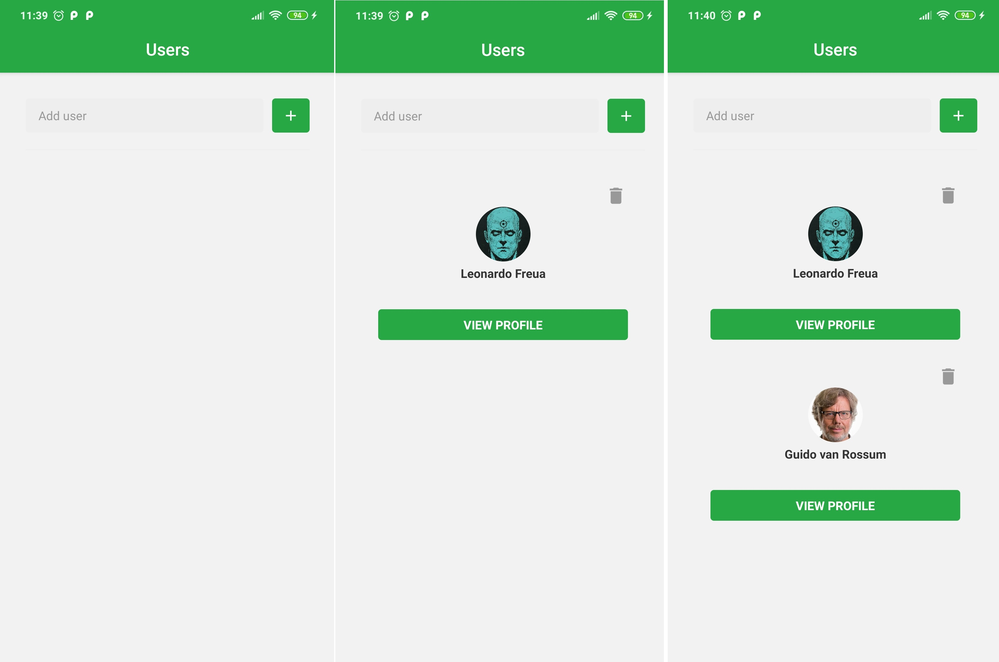
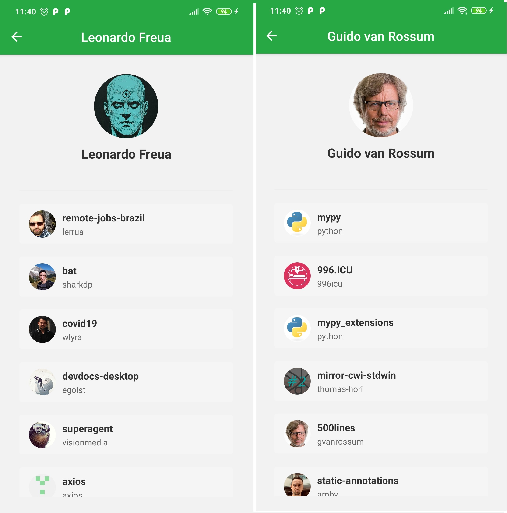

<h1 align="center">
    React Native Basic
</h1>

<h4 align="center">
  Project presenting a basic configuration of a React Native app.
</h4>

  

  

  

  

  <a href="#-tipics-covered">Topics Covered</a>&nbsp;&nbsp;&nbsp;|&nbsp;&nbsp;&nbsp;
  <a href="#-minidisc-installation">Installation</a>&nbsp;&nbsp;&nbsp;|&nbsp;&nbsp;&nbsp;
  <a href="#-how-to-contribute">How to contribute</a>&nbsp;&nbsp;&nbsp;|&nbsp;&nbsp;&nbsp;
  <a href="#memo-license">License</a>

 

  
  

# Topics covered

This project aims to teach the basic configuration of a `React Native` project. Below are topics
covered:

- [Reactotron configuration](https://github.com/Leonardofreua/reactNativeBasic/commit/dd87234fc55a4e7fd2e348c563b75e6fbc46ac22)
- [installing and Configuring the React Navigation](https://github.com/Leonardofreua/reactNativeBasic/commit/e67a3929cb2937b8ceb6486c12e137bfff4c40c6)
- [Configuration of the StatusBar](https://github.com/Leonardofreua/reactNativeBasic/commit/e82d4944b1e54dbd4f9f0eaa078a89cc4d35ac1d)
- [Getting started with Styled Components](https://github.com/Leonardofreua/reactNativeBasic/commit/988d27dc8674fd6533b846e8f3b8bef1e38e57bd)
- [Styling the form with Styled Components](https://github.com/Leonardofreua/reactNativeBasic/commit/a544fd6f938cc4b7ed352b262dd05fcfe843a010)
- [Making calls to Github API](https://github.com/Leonardofreua/reactNativeBasic/commit/9d635ec604d29eaf3f0c225a1754848c1ab61c79)
- [Stylizing the user list](https://github.com/Leonardofreua/reactNativeBasic/commit/33270038bce79b7a5353923625ecdd9f7f23d182)
- [Loading and disable of SubmitButton](https://github.com/Leonardofreua/reactNativeBasic/commit/068f9d11c4723dc098da4dfb2925b1a59df43453)
- [Saving users to the phone AsyncStorage](https://github.com/Leonardofreua/reactNativeBasic/commit/407edec8be7422387b91e78db5dab425780802e7)
- [Realizing navigation to User screen and valited the PropTypes](https://github.com/Leonardofreua/reactNativeBasic/commit/8d8521148513a47558215a8218b9e069a29ec4ec)
- [Searching the user's starred repositories](https://github.com/Leonardofreua/reactNativeBasic/commit/a37bbf4395ed8e5e928ecca580ac9336ec28543a)
- [Stylizing the Starred list](https://github.com/Leonardofreua/reactNativeBasic/commit/b2f3670900f7b89754d43d5236dfa0b8aa6057f0)
- [Removing users from the list](https://github.com/Leonardofreua/reactNativeBasic/commit/ffef3785c75b1167c4eaa2b6b3c9d7b99a67cfa8)

## :minidisc: Installation

Install an emulator for `Android` or `IOS` (MacOS only) or run the app directly on you **Smartphone**, connecting it via **USB**.

- Clone project: `git clone https://github.com/Leonardofreua/reactNativeBasic.git`
- Install the dependencies: `yarn install`
- To run on **Android**: `react-native run-android`
- To run on **IOS**: `react-native run-ios`
- In case of possible problems: `react-native start --reset-cache`

 For `IOS` it is necessary to install [Cocoapods](https://cocoapods.org/).

## 🤔 How to contribute

- Fork this repository;
- Create a branch with your feature: `git checkout -b my-feature`;
- Commit your changes: `git commit -m 'feat: My new feature'`;
- Push to your branch: `git push origin my-feature`.

Once your pull request merge is done, you can delete your branch.

## :memo: License

This project is under the MIT license. See [LICENSE](LICENSE) file for more details.
